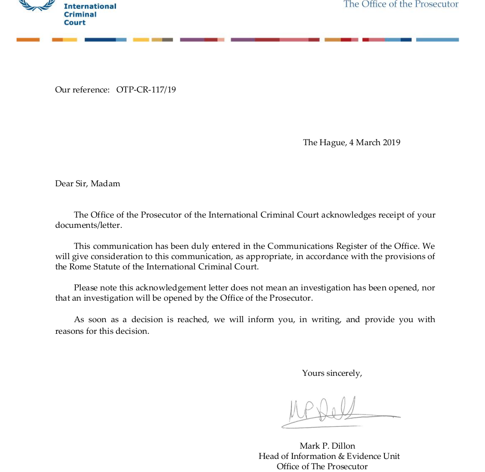
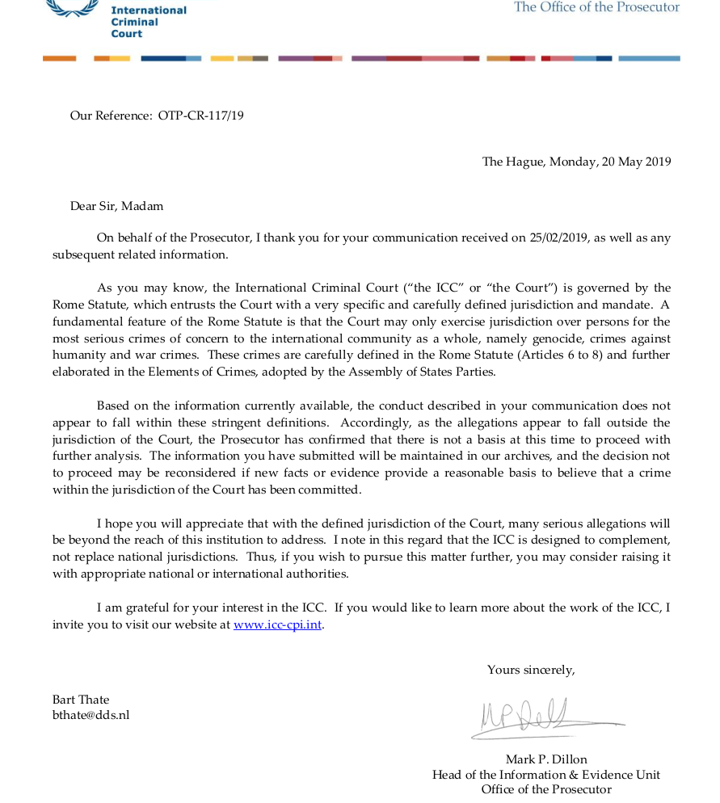
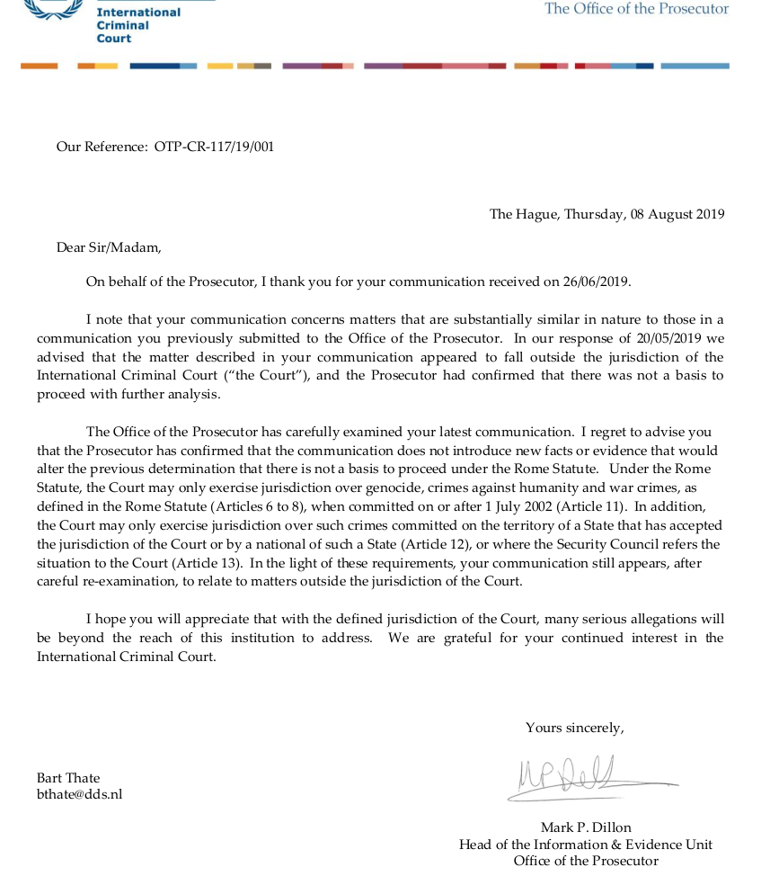

.. _writings:

.. raw:: html

      

.. title:: Writings

.. raw:: html

    
<b>CORRESPONDENCE</b>

     

**EMAIL 1**

|
| **From**: Bart Thate <bthate@dds.nl>
| **To**: otp.informationdesk@icc-cpi.int
| **Subject**: Information that the king of the netherlands is aware that the medicine administered with the use of new defines laws are proven to be poison and is commiting 3 of 5 genocide crimes on parts of the population here in the netherlands
| **Message-ID**: <e49d02a2-6a8e-ad64-6c8d-9abd45cf5c0e@dds.nl>
| **Date**: Mon, 21 Jan 2019 16:17:13 +0100
|

see :ref:`reconsider <reconsider>` for content.

.. raw:: html

     

**ACK**

.. raw:: html

     

.. raw:: html

     

**OTP-CR-117/19**

.. raw:: html

     

.. raw:: html

     

**EMAIL 2**

|
| **From:** Bart Thate <bthate@dds.nl>
| **To:** OTP InformationDesk <OTP.InformationDesk@icc-cpi.int>
| **Subject:** Request to reconsider OTP-CR-117/19
| **Message-ID:** <33777b52-6be9-72b2-f756-d5482d32f03d@dds.nl>
| **Date:** Wed, 26 Jun 2019 21:05:13 +0200
|

see :ref:`request <request>` for content.

.. raw:: html

     

**OTP-CR-117/19/001**

.. raw:: html

     

.. raw:: html

     
